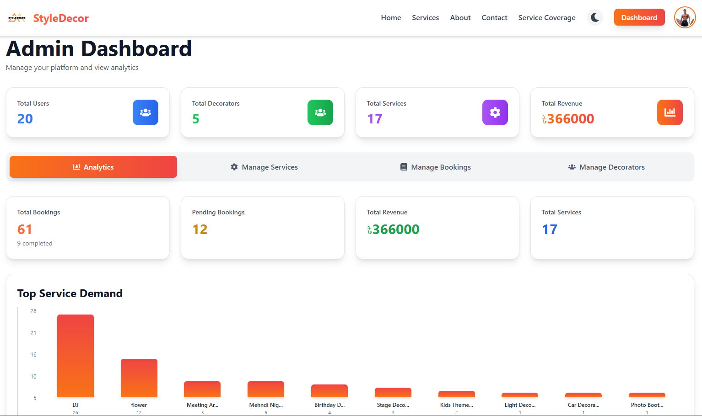

# StyleDecor - Smart Home & Ceremony Decoration Booking System


## 📋 Table of Contents

- [Project Overview](#project-overview)
- [Live Demo](#live-demo)
- [Purpose](#purpose)
- [Key Features](#key-features)
- [Screenshots](#screenshots)
- [Tech Stack](#tech-stack)
- [NPM Packages](#npm-packages)
- [Project Structure](#project-structure)
- [Setup Instructions](#setup-instructions)
- [Environment Variables](#environment-variables)
- [Available Scripts](#available-scripts)
- [Repository Links](#repository-links)
- [License](#license)

## 🎯 Project Overview

**StyleDecor** is a modern, full-stack web application designed for managing decoration service bookings. It provides a seamless experience for customers to book decoration services for homes, weddings, ceremonies, and special events, while offering comprehensive management tools for administrators and decorators.

## 🌐 Live Demo

**Live Application:** [https://style-decor-sami.vercel.app/](https://style-decor-sami.vercel.app/)

Experience the full application with all features including booking management, payment processing, and role-based dashboards.

## 🎨 Purpose

StyleDecor was built to solve the challenges of managing decoration service bookings in a digital environment. The platform serves three main user types:

- **Customers**: Browse services, book appointments, make secure payments, and track their bookings
- **Administrators**: Manage services, bookings, decorators, view analytics, and oversee the entire platform
- **Decorators**: View assigned projects, update project status, and track earnings

The system streamlines the entire booking process from service discovery to payment completion, making it easier for businesses to manage their decoration services efficiently.

## ✨ Key Features

### 🏠 User Features
- **Service Discovery**: Browse and search through a wide range of decoration services
- **Advanced Filtering**: Filter services by category, price range, and search terms
- **Booking Management**: Create, view, and cancel bookings with ease
- **Secure Payments**: Integrated Stripe payment processing for safe transactions
- **Payment History**: Track all payment transactions in one place
- **Interactive Maps**: View service coverage areas on an interactive map
- **User Dashboard**: Comprehensive dashboard to manage all bookings and payments

### 👨‍💼 Admin Features
- **Service Management**: Full CRUD operations for managing services
- **Booking Management**: View, assign decorators, and manage all bookings
- **Decorator Management**: Promote users to decorators, manage decorator accounts
- **Analytics Dashboard**: Real-time insights into revenue, bookings, and service demand
- **User Management**: View and manage all platform users
- **Revenue Tracking**: Monitor total revenue and payment statistics

### 🎨 Decorator Features
- **Project Assignment**: View all assigned projects in one place
- **Status Updates**: Update project status through a visual progress workflow
- **Earnings Tracking**: View total earnings (40% commission on completed projects)
- **Project Details**: Access complete project information including client details and notes
- **Real-time Updates**: Automatic refresh when project status changes

### 🎭 Platform Features
- **Role-Based Access Control**: Secure authentication with Firebase and JWT
- **Responsive Design**: Fully responsive design that works on all devices
- **Dark Mode**: Toggle between light and dark themes
- **Smooth Animations**: Beautiful UI animations powered by Framer Motion
- **Modern UI/UX**: Clean, intuitive interface built with Tailwind CSS and DaisyUI
- **Real-time Updates**: Live data synchronization using TanStack Query

## 📸 Screenshots

### Homepage


The homepage features a beautiful hero section with call-to-action buttons, service statistics, and an intuitive navigation system.

### Admin Dashboard


The admin dashboard provides comprehensive analytics, service management, booking oversight, and decorator management tools.

## 🛠 Tech Stack

### Frontend
- **React 19.2.1** - Modern UI library
- **Vite 7.2.4** - Next-generation frontend tooling
- **React Router v7** - Client-side routing
- **TanStack Query** - Server state management
- **Zustand** - Client state management
- **Framer Motion** - Animation library
- **Tailwind CSS** - Utility-first CSS framework
- **DaisyUI** - Component library for Tailwind
- **Axios** - HTTP client

### Backend Integration
- **Express.js** - Backend API server
- **MongoDB** - Database
- **Firebase Authentication** - User authentication
- **JWT** - Token-based authentication
- **Stripe** - Payment processing

### Additional Tools
- **React Leaflet** - Interactive maps
- **React Hot Toast** - Toast notifications
- **React Icons** - Icon library

## 📦 NPM Packages

### Dependencies

| Package | Version | Purpose |
|---------|---------|---------|
| `@stripe/react-stripe-js` | ^5.4.1 | Stripe React components |
| `@stripe/stripe-js` | ^8.5.3 | Stripe JavaScript SDK |
| `@tailwindcss/vite` | ^4.1.17 | Tailwind CSS Vite plugin |
| `@tanstack/react-query` | ^5.90.12 | Server state management |
| `@tanstack/react-query-devtools` | ^5.91.1 | React Query dev tools |
| `axios` | ^1.13.2 | HTTP client |
| `firebase` | ^12.6.0 | Firebase services |
| `framer-motion` | ^11.13.2 | Animation library |
| `jwt-decode` | ^4.0.0 | JWT token decoding |
| `leaflet` | ^1.9.4 | Map library |
| `react` | ^19.2.1 | React library |
| `react-dom` | ^19.2.1 | React DOM renderer |
| `react-hot-toast` | ^2.6.0 | Toast notifications |
| `react-icons` | ^5.3.0 | Icon library |
| `react-leaflet` | ^5.0.0 | React Leaflet components |
| `react-router-dom` | ^7.10.1 | React routing |
| `stripe` | ^20.0.0 | Stripe Node.js SDK |
| `zustand` | ^5.0.9 | State management |

### Dev Dependencies

| Package | Version | Purpose |
|---------|---------|---------|
| `@eslint/js` | ^9.39.1 | ESLint JavaScript config |
| `@types/react` | ^19.2.5 | React TypeScript types |
| `@types/react-dom` | ^19.2.3 | React DOM TypeScript types |
| `@vitejs/plugin-react` | ^5.1.1 | Vite React plugin |
| `autoprefixer` | ^10.4.20 | CSS autoprefixer |
| `daisyui` | ^5.5.8 | DaisyUI component library |
| `eslint` | ^9.39.1 | JavaScript linter |
| `eslint-plugin-react-hooks` | ^7.0.1 | React hooks ESLint plugin |
| `eslint-plugin-react-refresh` | ^0.4.24 | React refresh ESLint plugin |
| `globals` | ^16.5.0 | Global variables for ESLint |
| `postcss` | ^8.4.49 | CSS post-processor |
| `tailwindcss` | ^3.4.18 | Tailwind CSS framework |
| `vite` | ^7.2.4 | Build tool |

## 📁 Project Structure

```
style-decor-client/
├── public/
│   ├── _redirects
│   ├── styledecor1.png          # Homepage screenshot
│   ├── styledecor1admin.png      # Admin dashboard screenshot
│   └── vite.svg
├── src/
│   ├── assets/                   # Static assets (images, logos)
│   ├── authcontext/              # Authentication context
│   │   └── authcontext.jsx
│   ├── components/               # Reusable components
│   │   ├── dashboard/           # Dashboard components
│   │   │   ├── AdminDashboard.jsx
│   │   │   ├── Analytics.jsx
│   │   │   ├── DecoratorDashboard.jsx
│   │   │   ├── ManageBookings.jsx
│   │   │   ├── ManageDecorators.jsx
│   │   │   ├── ManageServices.jsx
│   │   │   └── UserDashboard.jsx
│   │   ├── ConfirmationModal.jsx
│   │   ├── Footer.jsx
│   │   ├── Layout.jsx
│   │   ├── Loading.jsx
│   │   ├── Modal.jsx
│   │   ├── Navbar.jsx
│   │   └── ServiceCoverageMap.jsx
│   ├── contexts/                 # React contexts
│   │   └── ThemeContext.jsx
│   ├── pages/                    # Page components
│   │   ├── Booking.jsx
│   │   ├── Dashboard.jsx
│   │   ├── ErrorPage.jsx
│   │   ├── Home.jsx
│   │   ├── Login.jsx
│   │   ├── Payment.jsx
│   │   ├── PaymentCancelled.jsx
│   │   ├── PaymentSuccess.jsx
│   │   ├── Register.jsx
│   │   ├── ServiceDetails.jsx
│   │   └── Services.jsx
│   ├── router/                   # Routing configuration
│   │   ├── protectedrout.jsx
│   │   └── routes.jsx
│   ├── util/                     # Utility functions
│   │   └── api.js
│   ├── App.css
│   ├── App.jsx
│   ├── index.css
│   └── main.jsx
├── .gitignore
├── eslint.config.js
├── index.html
├── package.json
├── postcss.config.js
├── README.md
├── tailwind.config.js
└── vite.config.js
```

## 🚀 Setup Instructions

### Prerequisites

- **Node.js** 18+ and npm
- **MongoDB** database (for backend)
- **Firebase** project (for authentication)
- **Stripe** account (for payments)

### Installation

1. **Clone the repository**

```bash
git clone https://github.com/XDR-SAM/StyleDecor-Cleint.git
cd StyleDecor-Cleint
```

2. **Install dependencies**

```bash
npm install
```

3. **Set up environment variables** (see [Environment Variables](#environment-variables))

4. **Start the development server**

```bash
npm run dev
```

The application will be available at `http://localhost:5173`

## 🔐 Environment Variables

Create a `.env` file in the root directory with the following variables:

```env
# API Configuration
VITE_API_URL=https://style-decor-server-ochre.vercel.app

# Firebase Configuration
VITE_FIREBASE_API_KEY=your_firebase_api_key
VITE_FIREBASE_AUTH_DOMAIN=your_firebase_auth_domain
VITE_FIREBASE_PROJECT_ID=your_firebase_project_id
VITE_FIREBASE_STORAGE_BUCKET=your_firebase_storage_bucket
VITE_FIREBASE_MESSAGING_SENDER_ID=your_firebase_messaging_sender_id
VITE_FIREBASE_APP_ID=your_firebase_app_id

# Stripe Configuration
VITE_STRIPE_PUBLISHABLE_KEY=your_stripe_publishable_key
```

## 📜 Available Scripts

| Script | Description |
|--------|-------------|
| `npm run dev` | Start development server |
| `npm run build` | Build for production |
| `npm run preview` | Preview production build |
| `npm run lint` | Run ESLint |

## 🔗 Repository Links

- **Frontend Repository**: [https://github.com/XDR-SAM/StyleDecor-Cleint.git](https://github.com/XDR-SAM/StyleDecor-Cleint.git)
- **Backend Repository**: [https://github.com/XDR-SAM/StyleDecor-Server.git](https://github.com/XDR-SAM/StyleDecor-Server.git)
- **Live Application**: [https://style-decor-sami.vercel.app/](https://style-decor-sami.vercel.app/)

## 🎯 Key Functionalities

### Booking Flow
1. User browses available services
2. Selects a service and views details
3. Creates a booking with date, location, and notes
4. Makes secure payment via Stripe
5. Booking is assigned to a decorator by admin
6. Decorator updates project status
7. Project completion triggers earnings calculation

### Payment Processing
- Secure Stripe Checkout integration
- Payment verification and confirmation
- Automatic booking status updates
- Payment history tracking

### Role-Based Access
- **User**: Can book services, make payments, view bookings
- **Admin**: Full platform management access
- **Decorator**: Can view assignments and update project status

## 🎨 Design Features

- **Modern UI**: Clean, intuitive interface with gradient accents
- **Responsive Design**: Works seamlessly on desktop, tablet, and mobile
- **Dark Mode**: Toggle between light and dark themes
- **Smooth Animations**: Framer Motion powered transitions
- **Interactive Elements**: Hover effects, loading states, and feedback
- **Accessibility**: Semantic HTML and ARIA labels

## 📊 Analytics & Insights

The admin dashboard provides:
- Total users, decorators, and services
- Revenue tracking and statistics
- Booking status breakdown
- Service demand analytics
- Top performing services

## 🔒 Security Features

- JWT token-based authentication
- Firebase authentication integration
- Protected routes
- Secure payment processing
- Role-based access control
- Input validation and sanitization

## 📝 License

This project is part of Assignment 11 from Programming Hero (PH).

## 👨‍💻 Author

**XDR-SAM**

- GitHub: [@XDR-SAM](https://github.com/XDR-SAM)
- Live Demo: [StyleDecor](https://style-decor-sami.vercel.app/)

## 🙏 Acknowledgments

- Programming Hero for the assignment framework
- All open-source contributors whose packages made this project possible
- Stripe for payment processing infrastructure
- Firebase for authentication services

---

**⭐ If you find this project helpful, please consider giving it a star!**
